# MARGE Demo — Dependency Graph & Parallel Execution Plan

**Document Number:** MRG-DEMO-002
**Date:** 2026-02-12
**Supersedes:** Day-by-day plan in MRG-DEMO-001 §6
**Prepared For:** The Department of Not Doing Things Sequentially

---

## 0. THE INSIGHT I MISSED

The previous plan was sequential: Day 1 do HA, Day 2 do Marge, Day 3 do dashboard.
That's wrong. The real dependency graph has **five parallel streams** that only
converge at integration gates. Multiple agents can work simultaneously from minute one.

Additionally: the CTS (conformance test suite) is not a nice-to-have — it's the
proof mechanism. Writing it, validating it against HA, and then using it to drive
Marge development is the whole thesis of the project. The demo is stronger if we
can say "these tests pass against HA, and they pass against Marge."

---

## 1. SHARED ARTIFACTS (Already Done)

These are the inputs everything else depends on. They're defined and frozen.

| Artifact | Status | Consumed By |
|---|---|---|
| Entity list (43 entities, 10 domains) | ✅ demo-plan.md §1.2 | All streams |
| REST API contract (GET/POST /api/states, etc.) | ✅ SSS §5.1.1 | CTS, Marge, Dashboard |
| WebSocket API contract | ✅ SSS §5.1.2 | CTS, Marge, Dashboard |
| MQTT topic hierarchy | ✅ SSS §5.2.1 | HA config, Marge, CTS |
| Automation definitions (6 automations) | ✅ automations.yaml | HA, Marge, CTS |
| Scenario timeline | ✅ scenario.json | Driver, Dashboard |

---

## 2. WORK STREAMS

### Stream A: HA Baseline (Agent 1)

Stand up Home Assistant in Docker with MQTT-backed entities. This is the
reference implementation everything validates against.

```
A1: Docker compose + mosquitto + HA config → HA starts with 43 entities
A2: Command bridge (MQTT command→state loop closer)
A3: GATE — HA running, all entities visible in /api/states
```

### Stream B: Scenario Driver (Agent 2)

Python script that drives the Day-in-the-Life timeline against any SUT.

```
B1: Driver script (reads scenario.json, sim-time management, REST+MQTT push)
B2: Steady-state generator (procedural sensor noise from generator rules)
B3: GATE — Dawn chapter plays against HA, morning automation fires correctly
```

### Stream C: Conformance Test Suite — Demo Subset (Agent 3)

The CTS is the executable spec. We write ~150 tests covering the demo surface
area, validate them ALL GREEN against HA, then use them as the acceptance
criteria for Marge. This is the Ralph loop feedback signal.

```
C1: Test infrastructure (conftest.py, REST/WS/MQTT client libs, fixtures)
C2: test_state_machine.py (~20 tests: CRUD, events, timestamps)
C3: test_ws_subscribe.py (~10 tests: connect, subscribe, event delivery)
C4: test_rest_services.py (~15 tests: service calls, error handling)
C5: Entity domain tests (~40 tests across 7 files):
    test_light.py, test_switch.py, test_lock.py, test_climate.py,
    test_alarm_control_panel.py, test_sensor.py, test_binary_sensor.py
C6: test_triggers.py + test_conditions.py + test_actions.py (~30 tests)
C7: test_scene.py (~10 tests)
C8: test_rest_health.py + test_startup.py (~10 tests: health endpoint, startup time)
C9: GATE — ALL tests green against HA-legacy
```

### Stream D: Marge Core (Agent 4)

The Rust implementation. Can start immediately because the API contract is
already defined. Builds speculatively — CTS validates it later.

```
D1: Cargo scaffold + embedded rumqttd broker
D2: State machine (DashMap) + REST API (axum): GET/POST /api/states
D3: Event bus (tokio::broadcast) + WebSocket subscribe_events
D4: Automation YAML parser (serde_yaml, 6 automations)
D5: Automation engine: state triggers + conditions + service call actions
D6: Sim-time endpoint + time triggers + sun triggers
D7: Scene support (batch state update)
D8: Health/metrics endpoint (/api/health, /proc/self RSS)
D9: Dockerfile + container build
```

### Stream E: Dashboard (Agent 5)

React app with ASCII house + metrics. Can start with mock data from day one.

```
E1: React scaffold (Vite + Tailwind + monospace theme)
E2: WebSocket client library (connects to HA and Marge simultaneously)
E3: ASCII house component (entity state map → colored terminal art)
E4: Metrics panel (side-by-side bars: memory, CPU, latency, events)
E5: Timeline bar (sim-time, speed, chapter markers)
E6: System status overlay (online/offline/starting for power outage)
```

---

## 3. DEPENDENCY GRAPH

```mermaid
graph TD
    %% ── Shared Artifacts (already done) ──
    SPEC["📋 Shared Artifacts<br/>Entity list, API contract,<br/>automations.yaml, scenario.json"]

    %% ── Stream A: HA Baseline ──
    A1["🅰️ A1: Docker + Mosquitto<br/>+ HA config files"]
    A2["🅰️ A2: Command bridge<br/>(MQTT cmd→state loop)"]
    A3{{"🅰️ GATE-HA<br/>HA running,<br/>43 entities in /api/states"}}

    SPEC --> A1
    A1 --> A2
    A2 --> A3

    %% ── Stream B: Scenario Driver ──
    B1["🅱️ B1: Scenario driver<br/>script (Python)"]
    B2["🅱️ B2: Steady-state<br/>generator engine"]
    B3{{"🅱️ GATE-SCENARIO-HA<br/>Dawn chapter plays,<br/>morning auto fires"}}

    SPEC --> B1
    B1 --> B2
    A3 --> B3
    B2 --> B3

    %% ── Stream C: CTS ──
    C1["🅲 C1: Test infra<br/>(conftest, clients,<br/>fixtures)"]
    C2["🅲 C2: State machine<br/>tests (~20)"]
    C3["🅲 C3: WebSocket<br/>tests (~10)"]
    C4["🅲 C4: Service call<br/>tests (~15)"]
    C5["🅲 C5: Entity domain<br/>tests (~40)"]
    C6["🅲 C6: Automation<br/>trigger/cond/action<br/>tests (~30)"]
    C7["🅲 C7: Scene tests<br/>(~10)"]
    C8["🅲 C8: Health/startup<br/>tests (~10)"]
    C9{{"🅲 GATE-CTS-HA<br/>~150 tests ALL GREEN<br/>against HA-legacy"}}

    SPEC --> C1
    C1 --> C2
    C1 --> C3
    C1 --> C4
    C1 --> C5
    C1 --> C6
    C1 --> C7
    C1 --> C8
    A3 --> C9
    C2 --> C9
    C3 --> C9
    C4 --> C9
    C5 --> C9
    C6 --> C9
    C7 --> C9
    C8 --> C9

    %% ── Stream D: Marge Core ──
    D1["🅳 D1: Cargo scaffold<br/>+ rumqttd broker"]
    D2["🅳 D2: State machine<br/>+ REST API"]
    D3["🅳 D3: WebSocket<br/>event stream"]
    D4["🅳 D4: Automation<br/>YAML parser"]
    D5["🅳 D5: Automation engine<br/>triggers/conds/actions"]
    D6["🅳 D6: Sim-time +<br/>time/sun triggers"]
    D7["🅳 D7: Scene support"]
    D8["🅳 D8: Health/metrics<br/>endpoint"]
    D9["🅳 D9: Dockerfile<br/>+ container build"]

    SPEC --> D1
    D1 --> D2
    D2 --> D3
    D2 --> D5
    D2 --> D7
    D2 --> D8
    D4 --> D5
    D5 --> D6
    D1 --> D4
    D8 --> D9

    %% ── Stream E: Dashboard ──
    E1["🅴 E1: React scaffold"]
    E2["🅴 E2: WebSocket<br/>client library"]
    E3["🅴 E3: ASCII house<br/>component"]
    E4["🅴 E4: Metrics panel"]
    E5["🅴 E5: Timeline bar"]
    E6["🅴 E6: System status<br/>overlay"]

    SPEC --> E1
    E1 --> E2
    E1 --> E3
    E1 --> E4
    E1 --> E5
    E2 --> E6

    %% ── Integration Gates ──
    GATE_CTS_MARGE{{"🔥 GATE-CTS-MARGE<br/>CTS green on Marge<br/>(Ralph loop here)"}}
    GATE_E2E{{"🔥 GATE-E2E<br/>Scenario plays on BOTH,<br/>dashboard shows it"}}
    GATE_DEMO{{"🏁 GATE-DEMO<br/>Polish, power outage,<br/>rehearsal"}}

    C9 --> GATE_CTS_MARGE
    D9 --> GATE_CTS_MARGE

    B3 --> GATE_E2E
    GATE_CTS_MARGE --> GATE_E2E
    E6 --> GATE_E2E

    GATE_E2E --> GATE_DEMO

    %% ── Styling ──
    classDef gate fill:#ff6b6b,stroke:#c0392b,color:#fff,font-weight:bold
    classDef spec fill:#3498db,stroke:#2980b9,color:#fff
    classDef streamA fill:#2ecc71,stroke:#27ae60,color:#000
    classDef streamB fill:#e67e22,stroke:#d35400,color:#fff
    classDef streamC fill:#9b59b6,stroke:#8e44ad,color:#fff
    classDef streamD fill:#e74c3c,stroke:#c0392b,color:#fff
    classDef streamE fill:#1abc9c,stroke:#16a085,color:#000

    class A3,B3,C9,GATE_CTS_MARGE,GATE_E2E,GATE_DEMO gate
    class SPEC spec
    class A1,A2 streamA
    class B1,B2 streamB
    class C1,C2,C3,C4,C5,C6,C7,C8 streamC
    class D1,D2,D3,D4,D5,D6,D7,D8,D9 streamD
    class E1,E2,E3,E4,E5,E6 streamE
```



---

## 4. WHAT CAN RUN IN PARALLEL — BY PHASE

```mermaid
gantt
    title Parallel Execution — 5 Agents
    dateFormat HH:mm
    axisFormat %H:%M

    section Agent 1 — HA
    A1 Docker+HA config      :a1, 00:00, 2h
    A2 Command bridge        :a2, after a1, 1h
    GATE-HA validation       :milestone, a3, after a2, 0h
    Idle / help others       :a4, after a3, 5h

    section Agent 2 — Driver
    B1 Scenario driver       :b1, 00:00, 3h
    B2 Generator engine      :b2, after b1, 2h
    GATE-SCENARIO-HA         :milestone, b3, after b2, 0h
    B3 Scenario against Marge:b4, 24:00, 2h

    section Agent 3 — CTS
    C1 Test infra            :c1, 00:00, 2h
    C2-C4 Core tests         :c2, after c1, 3h
    C5 Entity domain tests   :c5, after c1, 3h
    C6-C7 Auto+Scene tests   :c6, after c2, 3h
    C8 Health tests          :c8, after c2, 1h
    GATE-CTS-HA              :milestone, c9, after c6, 0h
    CTS vs Marge (Ralph loop):c10, 24:00, 8h

    section Agent 4 — Marge
    D1 Scaffold + MQTT       :d1, 00:00, 2h
    D2 State + REST          :d2, after d1, 3h
    D3 WebSocket             :d3, after d2, 2h
    D4 YAML parser           :d4, after d1, 2h
    D5 Automation engine     :d5, after d2, 4h
    D6 Time/sun triggers     :d6, after d5, 2h
    D7 Scenes                :d7, after d2, 1h
    D8 Health/metrics        :d8, after d2, 2h
    D9 Dockerfile            :d9, after d8, 1h
    GATE-CTS-MARGE           :milestone, d10, 32:00, 0h

    section Agent 5 — Dashboard
    E1 React scaffold        :e1, 00:00, 1h
    E2 WS client             :e2, after e1, 2h
    E3 ASCII house           :e3, after e1, 4h
    E4 Metrics panel         :e4, after e1, 3h
    E5 Timeline bar          :e5, after e1, 2h
    E6 System status         :e6, after e2, 1h
    Integration + polish     :e7, 24:00, 6h
```

---

## 5. THE CRITICAL PATH

```mermaid
graph LR
    SPEC["Shared<br/>Artifacts"] --> D1["D1: Marge<br/>Scaffold"]
    D1 --> D2["D2: State<br/>+ REST"]
    D2 --> D5["D5: Automation<br/>Engine"]
    D5 --> D6["D6: Time/Sun<br/>Triggers"]
    D6 --> D9["D9: Container"]
    D9 --> CTS_M{{"GATE:<br/>CTS vs Marge"}}
    CTS_M --> E2E{{"GATE:<br/>E2E Demo"}}
    E2E --> DEMO{{"🏁 DEMO"}}

    style CTS_M fill:#ff6b6b,stroke:#c0392b,color:#fff
    style E2E fill:#ff6b6b,stroke:#c0392b,color:#fff
    style DEMO fill:#ff6b6b,stroke:#c0392b,color:#fff
```



**The critical path is Marge's automation engine.** Everything else has slack.

If D5 (automation engine) slips, the fallback is hardcoding the 6 automations
as Rust match arms. Ugly but functional, and the CTS doesn't care how the
sausage is made.

---

## 6. PHASE BREAKDOWN (with parallel work at each phase)

### Phase 1: Bootstrap (Hours 0–4)

All five agents start simultaneously. Zero dependencies between streams at this point.

| Agent | Work | Depends On | Produces |
|---|---|---|---|
| 1 — HA | A1+A2: Docker, mosquitto, HA config, command bridge | Shared artifacts | Running HA instance |
| 2 — Driver | B1: Scenario driver script skeleton | Shared artifacts | Driver that can push events to any REST endpoint |
| 3 — CTS | C1: Test infrastructure, client libs, conftest.py | Shared artifacts | Test framework ready to write tests |
| 4 — Marge | D1+D2: Cargo scaffold, rumqttd, state machine, REST API | Shared artifacts | Marge binary that accepts/returns state via REST |
| 5 — Dashboard | E1+E3: React scaffold, ASCII house component | Shared artifacts | House renders from mock entity state |

**End of Phase 1 checkpoints:**
- HA responds to `curl http://localhost:8123/api/states` with 43 entities → **GATE-HA**
- Marge responds to `curl -X POST http://localhost:8124/api/states/light.test -d '{"state":"on"}'`
- Dashboard renders mock house layout in browser
- CTS conftest.py can instantiate REST/WS/MQTT clients
- Driver can push a single event to HA

### Phase 2: Core Functionality (Hours 4–12)

HA is running. Agents 2, 3, 4, 5 accelerate. Agent 1 assists or starts on Phase 3 stretch goals.

| Agent | Work | Depends On | Produces |
|---|---|---|---|
| 1 — HA | Idle (or: start writing Marge Dockerfile, or help Agent 3) | — | — |
| 2 — Driver | B2+B3: Generator engine, validate dawn chapter against HA | GATE-HA | **GATE-SCENARIO-HA** |
| 3 — CTS | C2-C8: Write all ~150 tests, run against HA iteratively | GATE-HA (for running) | Tests accumulating green against HA |
| 4 — Marge | D3-D8: WebSocket, YAML parser, automation engine, triggers, scenes, health | D2 (state machine) | Feature-complete Marge binary |
| 5 — Dashboard | E2+E4+E5: WS client, metrics panel, timeline bar | E1 (scaffold) | Dashboard ready for live data |

**End of Phase 2 checkpoints:**
- Scenario dawn chapter plays against HA successfully → **GATE-SCENARIO-HA**
- CTS has ~150 tests, all green against HA → **GATE-CTS-HA**
- Marge automation engine handles state triggers + conditions + service call actions
- Dashboard connects to real HA WebSocket, shows live entity updates

### Phase 3: Integration & Ralph Loop (Hours 12–24)

This is where the CTS meets Marge. The Ralph loop begins.

| Agent | Work | Depends On | Produces |
|---|---|---|---|
| 1 | Help Agent 4 fix Marge CTS failures | GATE-CTS-HA + Marge D9 | — |
| 2 | Run scenario against Marge, fix driver issues | Marge D9 | Scenario plays on both |
| 3 | Run CTS against Marge, file issues, refine tests | GATE-CTS-HA + Marge D9 | CTS results for Marge |
| 4 | **Ralph loop: CTS failures → fix → rerun → repeat** | GATE-CTS-HA | **GATE-CTS-MARGE** |
| 5 | E6: Wire dashboard to both systems, system status overlay | Both systems running | Dashboard shows dual view |

**End of Phase 3 checkpoints:**
- CTS passes against Marge (or: known failures documented with plan) → **GATE-CTS-MARGE**
- Scenario plays against both HA and Marge → **GATE-E2E**
- Dashboard shows side-by-side with real metrics

### Phase 4: Demo Polish (Hours 24–32)

| Agent | Work |
|---|---|
| 1 | Power outage sequence (docker stop/start, measure recovery) |
| 2 | Score card / summary overlay |
| 3 | CTS results badge (X/Y tests pass) for dashboard display |
| 4 | Performance optimization, fix any remaining CTS failures |
| 5 | Polish: colors, transitions, demo flow scripting |
| ALL | Rehearsal run-throughs (minimum 2) |

---

## 7. CTS DEMO SUBSET — WHAT TO WRITE

We don't need all 1,200 tests from the full CTS spec. We need the ~150 that
cover the demo surface area. Here's the scoping:


The performance tests (test_performance.py) only run against Marge — they
measure memory baseline, startup time, state change throughput, and API latency.
These numbers feed the dashboard metrics panel.

---

## 8. THE RALPH LOOP IN PRACTICE

Phase 3 is where the thesis proves itself. Here's how it works:

```mermaid
sequenceDiagram
    participant Agent as Agent 4 (Marge Dev)
    participant CTS as CTS Suite
    participant HA as HA-legacy
    participant Marge as Marge Binary

    Note over Agent,Marge: Phase 3 — Ralph Loop

    Agent->>Marge: Build + start container
    CTS->>HA: Run suite → 150/150 green ✅
    CTS->>Marge: Run suite → 87/150 green ❌

    Note over CTS: 63 failures.<br/>Top category: automation triggers (22 failures)

    CTS-->>Agent: Failure report (JSON)
    Agent->>Agent: Read failures, fix automation engine
    Agent->>Marge: Rebuild + restart

    CTS->>Marge: Run suite → 121/150 green ❌

    Note over CTS: 29 failures.<br/>Top: scene state capture (8), timestamps (6)

    CTS-->>Agent: Failure report
    Agent->>Agent: Fix scene logic + timestamp handling
    Agent->>Marge: Rebuild + restart

    CTS->>Marge: Run suite → 142/150 green ❌

    Note over CTS: 8 failures.<br/>Remaining: WebSocket edge cases (3),<br/>performance thresholds (5)

    CTS-->>Agent: Failure report
    Agent->>Agent: Fix WS framing, tune perf
    Agent->>Marge: Rebuild + restart

    CTS->>Marge: Run suite → 150/150 green ✅

    Note over Agent,Marge: GATE-CTS-MARGE passed 🎉
```



The key properties:
- **Each iteration is independent.** Marge reads from its source files and Cargo build cache, not from conversation history.
- **The feedback is machine-readable.** pytest JSON output → agent reads failures → fixes code.
- **Progress is monotonic.** Tests that pass stay passed (unless you break something, which the CTS catches).
- **A human doesn't need to watch.** This runs unattended. Walk away.

---

## 9. AGENT ASSIGNMENT TABLE

For Claude Code (or similar) agents running in parallel:

| Agent | Workspace | Primary Skills | Handoff Points |
|---|---|---|---|
| **Agent 1: HA Infra** | `./infrastructure/` | Docker, YAML, MQTT, HA config | Produces running HA → Agents 2, 3 consume |
| **Agent 2: Scenario** | `./scenario-driver/` | Python, async, MQTT, REST | Produces driver → validates against HA (Agent 1) and Marge (Agent 4) |
| **Agent 3: CTS** | `./tests/` | Python, pytest, async, httpx, websockets | Validates against HA first, then drives Marge dev |
| **Agent 4: Marge** | `./marge-core/` | Rust, tokio, axum, serde, rumqttd | Consumes CTS failures as work items |
| **Agent 5: Dashboard** | `./dashboard/` | React, TypeScript, Tailwind, WebSocket | Consumes WS events from Agents 1 + 4 |

**Communication protocol between agents:**
- Git repo is shared workspace (filesystem as truth)
- GATE milestones are verified by running a script: `./scripts/check-gate.sh <gate-name>`
- No agent needs to read another agent's conversation history
- Agent 4 reads `pytest --json-report` output to determine what to fix next

---

## 10. REVISED RISK MATRIX


The only item in the "must mitigate" quadrant is the Marge automation engine.
Mitigation: hardcode the 6 automations as match arms if YAML parsing + generic
engine proves too slow to build. The CTS doesn't test "how" — it tests "what."

---

## 11. HOW TO START RIGHT NOW

### Immediate actions (no dependencies):

1. **Create the git repo** with the directory structure:

```
marge-demo/
├── docker-compose.yml              # Already have this
├── scenario.json                   # Already have this
├── mosquitto/
│   └── mosquitto.conf              # Already have this
├── ha-config/
│   ├── configuration.yaml          # Already have this
│   ├── automations.yaml            # Already have this
│   └── scenes.yaml                 # Already have this
├── scenario-driver/
│   ├── Dockerfile
│   ├── requirements.txt
│   └── driver.py
├── tests/
│   ├── conftest.py
│   ├── clients/
│   │   ├── rest.py
│   │   ├── websocket.py
│   │   └── mqtt.py
│   ├── core/
│   │   └── test_state_machine.py
│   ├── entity/
│   │   └── test_light.py (etc.)
│   ├── automation/
│   │   └── test_triggers.py (etc.)
│   └── api/
│       └── test_rest_states.py
├── marge-core/
│   ├── Cargo.toml
│   ├── Dockerfile
│   └── src/
│       └── main.rs
├── dashboard/
│   ├── Dockerfile
│   ├── package.json
│   └── src/
│       └── App.tsx
└── scripts/
    ├── check-gate.sh
    └── run-cts.sh
```

2. **Fire up all 5 agents**, each pointed at their workspace directory, each given:
   - This plan document
   - The relevant section of the SSS/CTS/TheoryOps spec
   - Their specific stream's task list
   - The shared artifact definitions (entity list, API contract)

3. **The first convergence point is GATE-HA** (~2 hours in). Once HA is running,
   Agents 2 and 3 can start validating against it. Agents 4 and 5 don't need to wait.

---

## 12. WHAT MAKES THIS DEMO DEVASTATING

The demo tells three stories simultaneously:

**Story 1 (the house):** Identical behavior. Same automations, same triggers,
same outcomes. The CTS guarantees it. Watch the ASCII houses — they do the
same thing.

**Story 2 (the numbers):** Wildly different operational profile. 14MB vs 800MB.
Sub-millisecond vs double-digit millisecond latency. 0.4s vs 90s recovery.
The metrics panel makes this impossible to miss.

**Story 3 (the process):** "I wrote specs and tests. The AI wrote Rust.
The tests don't care who wrote the code." The CTS results badge on the
dashboard — 150/150 green against both systems — is the proof. And this
whole thing was built in 4 days by one person orchestrating AI agents.
That's not how we're using AI at work.
