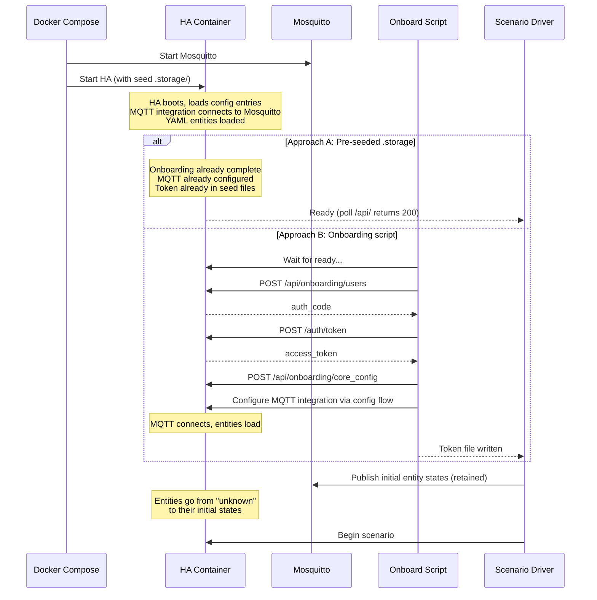
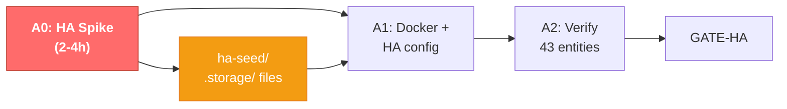

# MARGE Demo — HA Assumptions Deep Dive

**Document Number:** MRG-DEMO-003
**Date:** 2026-02-12
**Purpose:** Verify every assumption about how HA actually works before pressing start.
**Status:** LANDMINES FOUND. Read before coding anything.

---

## 0. NARRATIVE CORRECTION

The talking point in §12 of MRG-DEMO-002 was wrong. It said:

> "I wrote specs and tests. The AI wrote Rust."

Corrected version:

> "**I didn't write the specs, tests, or the Rust.** Claude did, in separate
> chats. I was the lazy dummy in the loop — I asked questions, argued about
> architecture, and pressed Enter. The AI wrote the MIL-STD-498 spec. The
> AI wrote 1,200 conformance tests. The AI wrote the Rust. The AI even
> wrote this demo plan. My job was to have opinions and not get in the way."

This makes story #3 *better*, not worse. If a Director of Engineering
spent four days doing nothing but prompting and the result is a
functionally-equivalent system to HA — that's the point. The bottleneck
is specification quality, not keystrokes.

---

## 1. ASSUMPTION REGISTER

Each assumption is graded:

- ✅ **CONFIRMED** — verified against docs/source, no action needed
- ⚠️ **PARTIALLY WRONG** — works differently than assumed, fix needed
- ❌ **WRONG** — will break the demo if not addressed
- 🔍 **NEEDS LIVE TEST** — can't fully verify from docs, must spike

---

### ❌ ASSUMPTION 1: "HA can be started headless with no manual steps"

**What we assumed:** Put config files in a volume, start the container, HA is ready.

**Reality:** HA requires interactive onboarding on first boot. You MUST:
1. Create an owner account (name, username, password)
2. Set home location, timezone, unit system
3. Select analytics preferences
4. Select initial integrations

Without completing onboarding, the REST API returns 401 on everything.
There is no `skip_onboarding: true` config option.

**Mitigation — Onboarding Script:**

HA exposes onboarding API endpoints that the frontend uses. We script them:

```bash
#!/bin/bash
# ha-onboard.sh — complete onboarding via API

HA_URL="http://localhost:8123"

# 1. Wait for HA to be ready
echo "Waiting for HA..."
until curl -sf "$HA_URL/api/onboarding" > /dev/null 2>&1; do
  sleep 2
done

# 2. Create owner account (returns auth_code)
RESULT=$(curl -s -X POST "$HA_URL/api/onboarding/users" \
  -H "Content-Type: application/json" \
  -d '{"client_id":"http://localhost:8123/","name":"Demo","username":"demo","password":"demo1234","language":"en"}')

AUTH_CODE=$(echo "$RESULT" | jq -r '.auth_code')

# 3. Exchange auth_code for tokens
TOKENS=$(curl -s -X POST "$HA_URL/auth/token" \
  -d "grant_type=authorization_code&code=$AUTH_CODE&client_id=http://localhost:8123/")

ACCESS_TOKEN=$(echo "$TOKENS" | jq -r '.access_token')

# 4. Complete remaining onboarding steps
curl -s -X POST "$HA_URL/api/onboarding/core_config" \
  -H "Authorization: Bearer $ACCESS_TOKEN" \
  -H "Content-Type: application/json"

curl -s -X POST "$HA_URL/api/onboarding/analytics" \
  -H "Authorization: Bearer $ACCESS_TOKEN" \
  -H "Content-Type: application/json"

curl -s -X POST "$HA_URL/api/onboarding/integration" \
  -H "Authorization: Bearer $ACCESS_TOKEN" \
  -H "Content-Type: application/json" \
  -d '{"client_id":"http://localhost:8123/","redirect_uri":"http://localhost:8123/"}'

# 5. Create long-lived access token via WebSocket
# (Long-lived tokens can only be created via WS, not REST)
# Alternative: just use the access_token from step 3 (valid for 30 min)
# and refresh as needed, or use trusted_networks to bypass auth entirely.

echo "ACCESS_TOKEN=$ACCESS_TOKEN" > /tmp/ha_token
echo "Onboarding complete. Token saved."
```

**Severity:** HIGH — without this, nothing works.
**Added to plan:** New task A0 in Stream A, before everything else.

**Alternative:** Pre-seed the `.storage/` directory with auth and onboarding
JSON files copied from a completed HA install. Fragile but faster.
🔍 **NEEDS LIVE SPIKE** to determine which approach is more reliable.

---

### ❌ ASSUMPTION 2: "MQTT broker config goes in configuration.yaml"

**What we assumed:** We can put broker connection settings in YAML like:
```yaml
mqtt:
  broker: mosquitto
  port: 1883
```

**Reality:** Since ~2022.6, the MQTT broker connection is configured via
the UI integration flow, NOT via YAML. The YAML `mqtt:` key only defines
entities. The broker connection is stored as a "config entry" in
`.storage/core.config_entries`.

If you put broker settings in `configuration.yaml`, HA either ignores
them or throws a deprecation warning.

**Mitigation — Pre-seed config entry:**

We can pre-create the `.storage/core.config_entries` file with the MQTT
integration configured. Structure:

```json
{
  "version": 1,
  "minor_version": 3,
  "key": "core.config_entries",
  "data": {
    "entries": [
      {
        "entry_id": "mqtt_entry_id",
        "version": 1,
        "minor_version": 2,
        "domain": "mqtt",
        "title": "Mosquitto",
        "data": {
          "broker": "mosquitto",
          "port": 1883,
          "username": "",
          "password": "",
          "discovery": true
        },
        "options": {},
        "pref_disable_new_entities": false,
        "pref_disable_polling": false,
        "source": "user",
        "unique_id": null,
        "disabled_by": null
      }
    ]
  }
}
```

🔍 **NEEDS LIVE SPIKE** — exact JSON schema for 2024.12 config entries.
Must boot HA, configure MQTT via UI, then copy the generated .storage files
as our "seed". This is the cleanest approach.

**Alternative:** Complete MQTT integration setup via the onboarding script
after creating the user:
```bash
curl -s -X POST "$HA_URL/api/config/config_entries/flow" \
  -H "Authorization: Bearer $ACCESS_TOKEN" \
  -H "Content-Type: application/json" \
  -d '{"handler":"mqtt"}'
# Then complete the flow steps...
```

**Severity:** HIGH — without MQTT integration configured, no entities load.

---

### ⚠️ ASSUMPTION 3: "MQTT YAML entity format is `mqtt: light: [...]`"

**What we assumed:** Modern nested format under `mqtt:` key.

**Reality:** Confirmed as correct for 2024.12. The format IS:
```yaml
mqtt:
  light:
    - name: "Bedroom"
      state_topic: "home/bedroom/light/state"
      command_topic: "home/bedroom/light/set"
```

The OLD format (`light: - platform: mqtt`) was deprecated in 2022.6 and
removed in 2022.12.

**Our ha-config/configuration.yaml from MRG-DEMO-001 uses the correct format.** ✅

BUT: entity YAML is loaded only after the MQTT integration (broker
connection) is configured. So Assumption 2 must be solved first.

**Severity:** MEDIUM — format is correct, but depends on Assumption 2.

---

### ❌ ASSUMPTION 4: "POST /api/states can drive MQTT entity state"

**What we assumed:** Scenario driver calls POST /api/states/sensor.bedroom_temp
to push new temperature readings into HA.

**Reality:** POST /api/states ONLY updates HA's internal state object.
It does NOT:
- Publish to any MQTT topic
- Trigger the entity's integration to update
- Persist through the next MQTT state message

For MQTT entities, the next message on the state_topic will **overwrite**
whatever was set via the REST API. And critically, if no MQTT message
has ever been received, the entity may be in "unknown" or "unavailable"
state regardless of what the REST API says.

Furthermore, POST /api/states for an integration-managed entity (like
MQTT) creates a *ghost entity* — it appears in the state list but the
integration doesn't know about it.

**For sensors/binary_sensors:** The scenario driver should publish directly
to MQTT state topics, NOT use the REST API.

**For service calls (light.turn_on, etc.):** These are fine via
POST /api/services/light/turn_on. HA will publish the command to MQTT.

**Mitigation:** Scenario driver speaks MQTT to Mosquitto, not REST to HA.

```python
# WRONG:
requests.post(f"{HA_URL}/api/states/sensor.bedroom_temp",
              json={"state": "72.1"})

# RIGHT:
mqtt_client.publish("home/bedroom/temperature", "72.1", retain=True)
```

**Severity:** HIGH — scenario driver architecture change. But actually
simpler. We already planned this; just need to be rigorous about it.

---

### ❌ ASSUMPTION 5: "HA updates entity state when it sends a command"

**What we assumed:** When automation calls `light.turn_on`, HA both
publishes to MQTT and updates its internal state.

**Reality:** By default, MQTT entities are NOT optimistic. When HA calls
`light.turn_on`, it publishes "ON" to the command_topic and then **waits**
for a message on the state_topic before updating the entity state. If
no message comes back, the light entity stays in its previous state.

In a real deployment, the physical device receives the command, changes
state, and publishes back. We have no physical devices.

**Mitigation — Two options:**

**Option A: Optimistic mode (RECOMMENDED for demo)**
```yaml
mqtt:
  light:
    - name: "Bedroom"
      command_topic: "home/bedroom/light/set"
      state_topic: "home/bedroom/light/state"
      optimistic: true  # ← immediately assume state changed
```

Pro: Simple, no extra components. State updates instantly.
Con: Slightly less realistic (real devices echo back).

**Option B: Command bridge script**
A small Python/Node script that subscribes to all `*/set` topics and
echoes the payload to the corresponding `*/state` topic:

```python
# command_bridge.py
def on_message(client, userdata, msg):
    if msg.topic.endswith("/set"):
        state_topic = msg.topic.rsplit("/set", 1)[0] + "/state"
        client.publish(state_topic, msg.payload, retain=True)
```

Pro: More realistic, matches how real devices work.
Con: Another moving part. Latency for state update.

**Recommendation:** Use optimistic mode for the demo. It's simpler,
removes a failure mode, and the CTS tests don't care about the MQTT
round-trip — they test the state machine behavior.

**Severity:** HIGH — without this, automations that check state after
commanding a device will see stale data.

---

### ⚠️ ASSUMPTION 6: "automation.trigger bypasses conditions"

**What we assumed:** We can force-fire time-triggered automations via
POST /api/services/automation/trigger.

**Reality:** Confirmed. `automation.trigger` does bypass conditions by
default. You can pass `skip_condition: false` to evaluate conditions.

BUT: `automation.trigger` does NOT provide trigger variables. So
automations that use `trigger.id` or `trigger.to_state` in their actions
will see empty/null trigger data.

**Our 6 automations:**
- morning_wakeup: time trigger → actions don't use trigger vars ✅
- security_alert: state trigger → actions use condition, not trigger vars ✅
- sunset_lights: sun trigger → actions don't use trigger vars ✅
- goodnight_routine: event trigger → actions don't use trigger vars ✅
- lock_verification: state trigger → actions don't use trigger vars ✅
- smoke_co_emergency: state trigger → actions don't use trigger vars ✅

**We're safe.** None of our automations reference trigger variables.

**For time/sun triggers:** Scenario driver force-fires via
`automation.trigger`. For state triggers: they fire naturally because the
scenario driver pushes state changes via MQTT.

**Severity:** LOW — confirmed to work as planned.

---

### ⚠️ ASSUMPTION 7: "Template buttons generate events we can trigger on"

**What we assumed:** Our goodnight automation uses a "bedside button" that
fires an event when pressed.

**Reality:** MQTT buttons work via `command_topic` (outbound) but don't
have a natural "press" event mechanism like physical Zigbee buttons.
An MQTT `button` entity triggers its `press` action when the user presses
it in the UI or calls the `button.press` service.

For our scenario: the scenario driver should call
`POST /api/services/button/press` with entity_id = button.bedside.
This fires the entity's press action. If the goodnight automation
triggers on `state` changes of the button entity, this should work.

BUT: HA button entities don't really have a "state" — they just have a
timestamp of last press. So using a state trigger on a button entity
might not fire the automation.

**Better approach:** Use an `event` trigger in the automation:
```yaml
trigger:
  - trigger: state
    entity_id: button.bedside
```

Actually, for MQTT buttons, the `button.press` service publishes to
the command_topic. The button entity then updates its state to a
timestamp.

🔍 **NEEDS LIVE SPIKE** — test whether state trigger on button entity
fires when button.press is called. If not, switch to event-based trigger
or use an input_boolean toggle instead.

**Fallback:** Replace button with `input_boolean.bedside_trigger`. Toggle
it on, automation fires on state change to "on", first action toggles it
back off.

**Severity:** MEDIUM — may need to change one automation trigger type.

---

### ✅ ASSUMPTION 8: "WebSocket API supports subscribe_events"

**What we assumed:** Dashboard connects via WebSocket, subscribes to
state_changed events, gets real-time updates.

**Reality:** Confirmed. HA WebSocket API supports:
```json
{"id": 1, "type": "auth", "access_token": "TOKEN"}
{"id": 2, "type": "subscribe_events", "event_type": "state_changed"}
```

Returns events in real-time. Well-documented, widely used. Dashboard
will work exactly as planned.

**Severity:** NONE.

---

### ✅ ASSUMPTION 9: "We can use HA 2024.12 Docker image"

**What we assumed:** `ghcr.io/home-assistant/home-assistant:2024.12`

**Reality:** Confirmed. Image is available. Uses Python 3.12. ~1.5GB
image, starts in 30-90 seconds depending on integrations loaded.

Requires `--network=host` or explicit port mapping.
Requires volume mount for `/config`.
Does NOT require `--privileged` for our use case (no USB devices).

**Severity:** NONE.

---

### ⚠️ ASSUMPTION 10: "Alarm control panel works like other MQTT entities"

**What we assumed:** MQTT alarm_control_panel with state/command topics.

**Reality:** There are TWO different alarm panel integrations:

1. **`mqtt` alarm_control_panel** — Represents a *remote* alarm (the
   alarm logic lives in the physical device). HA just displays state and
   forwards commands. States: disarmed, armed_home, armed_away,
   armed_night, armed_vacation, triggered, arming, pending.

2. **`manual_mqtt`** alarm_control_panel — HA *is* the alarm. It manages
   pending times, trigger durations, etc. MQTT is just the communication
   layer for external panels.

**For our demo:** We want option 1 (pure MQTT). The scenario driver sets
alarm state, HA displays it, automations react to it. The goodnight
automation should be able to change alarm state by publishing to the
command topic.

But: when an automation calls `alarm_control_panel.alarm_arm_night`,
HA publishes "ARM_NIGHT" to the command_topic. In non-optimistic mode,
it waits for state_topic to confirm. This is the same issue as
Assumption 5.

**Mitigation:** Same as Assumption 5 — use optimistic mode or command bridge.
For alarm_control_panel, the config option isn't `optimistic` but rather
it depends on having a state_topic defined. If we define both state_topic
and command_topic, and use the command bridge or publish back manually,
it works.

**Simpler option:** Since scenario driver controls the alarm, it can
subscribe to the command_topic and echo ARM_NIGHT → "armed_night" on
the state_topic. This is part of the command bridge from Assumption 5.

**Severity:** MEDIUM — addressed by same fix as Assumption 5.

---

### ✅ ASSUMPTION 11: "Scenes activate by calling scene.turn_on"

**What we assumed:** scene.turn_on applies all entity states in the scene.

**Reality:** Confirmed. `scene.turn_on` with entity_id `scene.evening`
calls the appropriate services for each entity in the scene definition.
For MQTT lights, this means publishing to their command topics.

The scene definition in scenes.yaml is correct:
```yaml
- name: evening
  entities:
    light.living_room_main:
      state: "on"
      brightness: 180
```

When activated, HA calls `light.turn_on` for each entity with the
specified attributes.

**Severity:** NONE.

---

### ⚠️ ASSUMPTION 12: "MQTT integration loads from YAML automatically"

**What we assumed:** Put `mqtt:` section in configuration.yaml, HA loads
entities on startup.

**Reality:** The MQTT entity definitions in YAML (`mqtt: light: [...]`)
are loaded only AFTER the MQTT integration is set up (broker connection
configured). The integration setup happens via config entry, not YAML.

So the order is:
1. HA starts
2. Config entries are loaded (from .storage/core.config_entries)
3. If MQTT config entry exists → connects to broker → loads YAML entities
4. If no MQTT config entry → YAML entities are IGNORED

**This means:** We MUST pre-configure the MQTT config entry (Assumption 2)
OR set it up via the onboarding/integration flow.

**Severity:** HIGH — same as Assumption 2. They're the same problem.

---

### 🔍 ASSUMPTION 13: "Sun integration uses configurable location"

**What we assumed:** sun.sun entity calculates sunrise/sunset from the
configured home location.

**Reality:** Confirmed. The sun integration uses the location from
`configuration.yaml` or from the core config set during onboarding.
For our demo location (Lehi, UT: 40.3916, -111.8508), sunrise/sunset
will be calculated correctly.

BUT: sun triggers fire based on the REAL wall clock, not sim-time.
This is already addressed in our plan — scenario driver force-fires
sun-triggered automations via `automation.trigger`.

What we SHOULD verify: does `sun.sun` entity update its state
(above_horizon/below_horizon) based on wall clock? If sim-time is at
sunset but wall clock is at noon, sun.sun will show "above_horizon".

**For the demo:** The scenario driver should also update `sun.sun` state
directly via POST /api/states (this is one case where POST /api/states
IS appropriate — sun.sun is not an MQTT entity):

```python
requests.post(f"{HA_URL}/api/states/sun.sun",
  headers={"Authorization": f"Bearer {TOKEN}"},
  json={
    "state": "below_horizon",
    "attributes": {
      "next_rising": "2025-01-15T06:47:00-07:00",
      "next_setting": "2025-01-15T17:32:00-07:00",
      "elevation": -5.2,
      "azimuth": 265.3,
      "rising": false,
      "friendly_name": "Sun"
    }
  })
```

🔍 **NEEDS LIVE SPIKE** — verify that POST /api/states on sun.sun sticks
(it should, since sun.sun updates infrequently from the astral library).

**Severity:** MEDIUM — need to manage sun state in the driver.

---

## 2. MANDATORY SPIKE BEFORE DAY 1

Before starting the 5 parallel streams, we need a 2-4 hour spike to
validate the critical unknowns. ONE person (or agent) does this:

```
1. docker run HA 2024.12 with empty config volume
2. Complete onboarding manually in browser, note the .storage files created
3. Configure MQTT integration via UI, note the config_entries.json
4. Add 3 test entities via YAML: 1 light, 1 sensor, 1 alarm panel
5. Restart HA, verify entities load
6. Test:
   a. Publish to sensor state_topic → verify entity updates in HA
   b. Call light.turn_on → verify MQTT publish to command_topic
   c. With optimistic:true → verify entity state updates immediately
   d. Call automation.trigger → verify it fires
   e. POST /api/states/sun.sun → verify it sticks
   f. Call button.press → verify state trigger fires on button entity
   g. WebSocket subscribe_events → verify events arrive
7. Copy .storage/ directory contents as our "seed" for automated setup
8. Write ha-onboard.sh script, test it works from cold start
```

**Deliverable:** A `ha-seed/` directory containing:
- `.storage/core.config_entries` (with MQTT broker config)
- `.storage/auth*` files (blank, pre-onboarding)
- `.storage/onboarding` (marked as NOT done)
- `ha-onboard.sh` script that completes onboarding + returns token

OR: `.storage/` directory from a completed setup, which we mount
directly — skipping onboarding entirely. (Simpler but less clean.)

---

## 3. REVISED HA CONFIG ARCHITECTURE

Based on findings above, the HA setup is more complex than assumed:



**Recommendation:** Approach A (pre-seeded .storage) is more reliable for
a demo. Do the manual setup once, snapshot the .storage directory, commit
it to the repo. Every `docker compose up` gets a fully configured HA.

---

## 4. IMPACT ON CONFIGURATION FILES

### configuration.yaml — REVISED

```yaml
homeassistant:
  name: Marge Demo Home
  latitude: 40.3916
  longitude: -111.8508
  elevation: 1400
  unit_system: us_customary
  time_zone: America/Denver

# API must be explicitly enabled for REST API access
api:

# MQTT entities ONLY (broker config is in .storage/core.config_entries)
mqtt:
  light:
    - name: "Bedroom"
      unique_id: light_bedroom
      state_topic: "home/bedroom/light/state"
      command_topic: "home/bedroom/light/set"
      brightness_state_topic: "home/bedroom/light/brightness/state"
      brightness_command_topic: "home/bedroom/light/brightness/set"
      brightness_scale: 255
      optimistic: true                          # ← CRITICAL
      payload_on: "ON"
      payload_off: "OFF"
    # ... (8 more lights, all with optimistic: true)

  switch:
    - name: "Coffee Maker"
      unique_id: switch_coffee_maker
      state_topic: "home/kitchen/coffee/state"
      command_topic: "home/kitchen/coffee/set"
      optimistic: true
      payload_on: "ON"
      payload_off: "OFF"

  lock:
    - name: "Front Door Lock"
      unique_id: lock_front_door
      state_topic: "home/entryway/lock/state"
      command_topic: "home/entryway/lock/set"
      optimistic: true
      payload_lock: "LOCK"
      payload_unlock: "UNLOCK"
    # ... (1 more lock)

  climate:
    - name: "Main Thermostat"
      unique_id: climate_main
      mode_state_topic: "home/hvac/mode/state"
      mode_command_topic: "home/hvac/mode/set"
      temperature_state_topic: "home/hvac/target_temp/state"
      temperature_command_topic: "home/hvac/target_temp/set"
      current_temperature_topic: "home/hvac/current_temp"
      modes:
        - "off"
        - "heat"
        - "cool"
        - "auto"
      optimistic: true

  alarm_control_panel:
    - name: "Home Security"
      unique_id: alarm_home_security
      state_topic: "home/alarm/state"
      command_topic: "home/alarm/set"
      # No optimistic flag — driver echoes commands to state topic

  sensor:
    - name: "Bedroom Temperature"
      unique_id: sensor_bedroom_temp
      state_topic: "home/bedroom/temperature"
      unit_of_measurement: "°F"
      device_class: temperature
    # ... (13 more sensors, all receive-only, no optimistic needed)

  binary_sensor:
    - name: "Entryway Motion"
      unique_id: binary_sensor_entryway_motion
      state_topic: "home/entryway/motion/state"
      device_class: motion
      payload_on: "ON"
      payload_off: "OFF"
    # ... (8 more binary sensors)

# Automations and scenes
automation: !include automations.yaml
scene: !include scenes.yaml
```

Key changes from MRG-DEMO-001:
1. Added `api:` integration explicitly
2. Added `optimistic: true` to all controllable entities
3. Removed MQTT broker config from YAML (goes in .storage)
4. Added `unique_id` to all entities (required for entity registry)
5. Added `brightness_scale: 255` for lights

---

## 5. SCENARIO DRIVER PROTOCOL — REVISED

```python
# Scenario driver speaks MQTT for state, REST for services
class ScenarioDriver:
    def push_sensor_state(self, entity_suffix, value):
        """Push sensor/binary_sensor state via MQTT"""
        self.mqtt.publish(
            f"home/{entity_suffix}",
            str(value),
            retain=True
        )

    def call_service(self, domain, service, entity_id, **kwargs):
        """Call HA service via REST (for automation.trigger, etc.)"""
        requests.post(
            f"{self.ha_url}/api/services/{domain}/{service}",
            headers={"Authorization": f"Bearer {self.token}"},
            json={"entity_id": entity_id, **kwargs}
        )

    def set_sun_state(self, state, attributes):
        """Override sun.sun via REST (non-MQTT entity)"""
        requests.post(
            f"{self.ha_url}/api/states/sun.sun",
            headers={"Authorization": f"Bearer {self.token}"},
            json={"state": state, "attributes": attributes}
        )

    def fire_time_automation(self, automation_id):
        """Force-fire time/sun triggered automations"""
        self.call_service("automation", "trigger", automation_id)
```

---

## 6. SUMMARY OF CHANGES

| Item | Old Plan | New Plan | Effort |
|---|---|---|---|
| HA onboarding | "Just start it" | Pre-seed .storage/ from manual setup | +2h spike |
| MQTT broker config | In configuration.yaml | In .storage/core.config_entries | Part of spike |
| Sensor state push | REST API | MQTT publish directly | Driver change |
| Controllable entities | Default (non-optimistic) | `optimistic: true` on all | Config change |
| sun.sun state | "HA handles it" | Driver manages via POST /api/states | Driver change |
| Auth tokens | "Somehow" | Pre-seeded or onboarding script | Part of spike |
| Button trigger | State trigger | 🔍 Verify in spike, may need input_boolean | Spike verifies |

**Net impact on timeline:** +2-4 hours for the spike. But it PREVENTS
2+ days of debugging "why doesn't HA work" during the actual build.

---

## 7. THE SPIKE IS STREAM A, TASK A0

This goes at the very beginning. Nothing else starts until we have a
validated, repeatable HA setup that boots headless with all entities
loaded and API accessible.



Note: Streams B (driver), C (CTS), D (Marge), E (dashboard) can still
start in parallel — they don't need a running HA instance for their
initial tasks. But GATE-CTS-HA and GATE-SCENARIO-HA both depend on
GATE-HA, which depends on A0.
